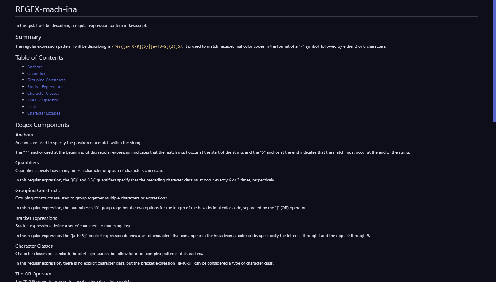

# REGEX-mach-ina

## Description

This REGEX-mach-ina was created for boot camp students who were going through Module 17. It contains a gist describing the regular expression `/^#?([a-f0-9]{6}|[a-f0-9]{3})$/`.

## Table of Contents

* [Installation](#installation)
* [Usage](#usage)
* [License](#license)
* [Screenshots](#screenshots)
* [Tests](#tests)
* [Contributing](#contributing)
* [Questions](#questions)

## Installation

N/A

## Usage

Please find the gist in the tutorial folder!

## License

N/A

## Screenshots

## Tests

N/A

## Questions

Github Profile: [seafoodude](https://github.com/seafoodude)
Email: [seafoodude@gmail.com](seafoodude@gmail.com)

## Contributing

Special thanks to Emma, Big Mike, Patricia, Bryan, and Shawn for guiding me through this experience!